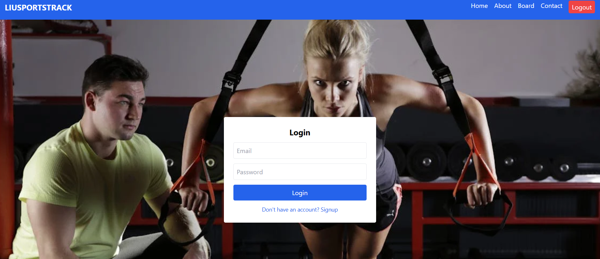
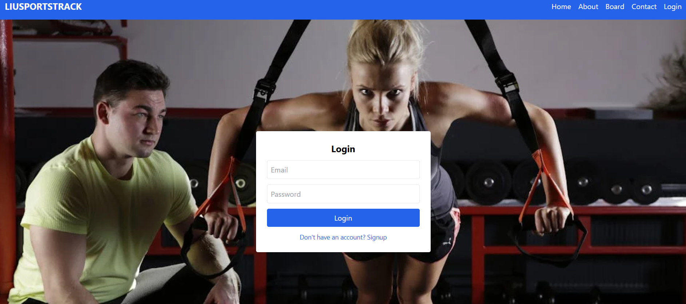
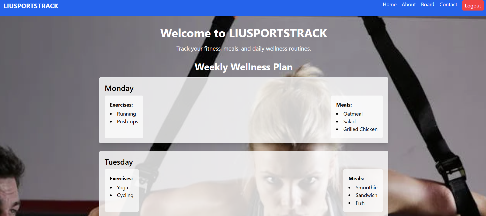
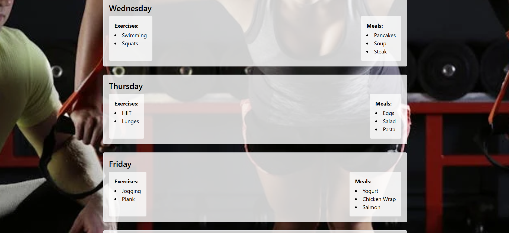
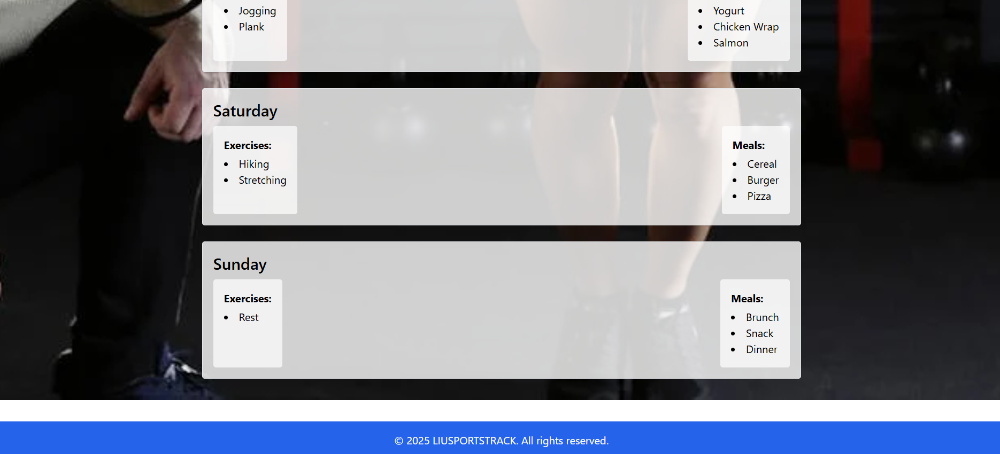
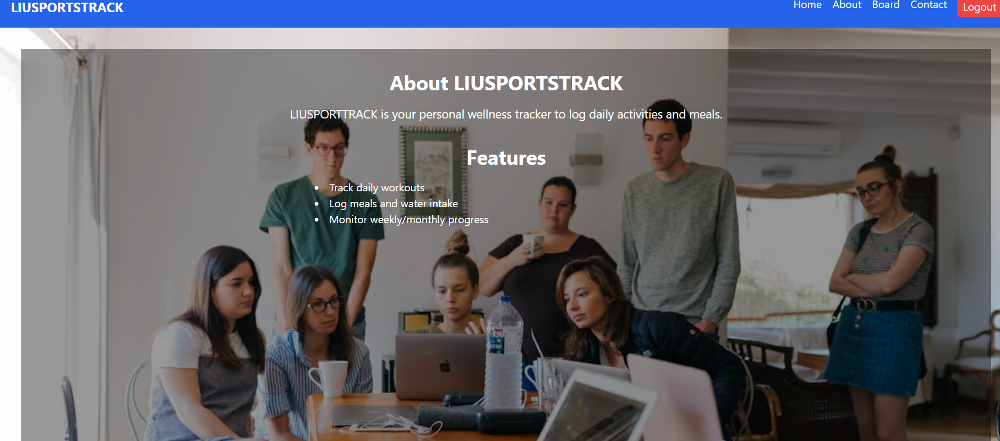
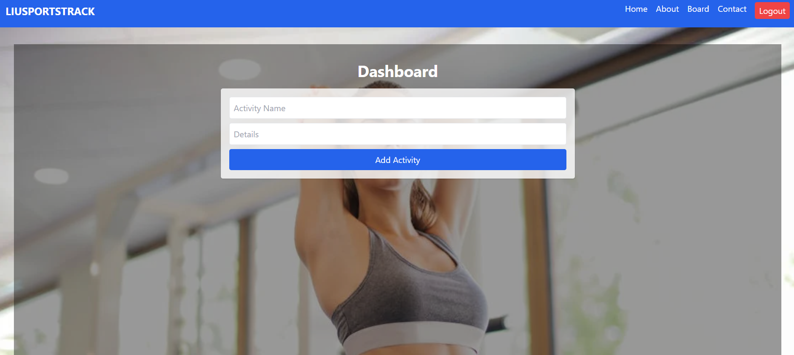
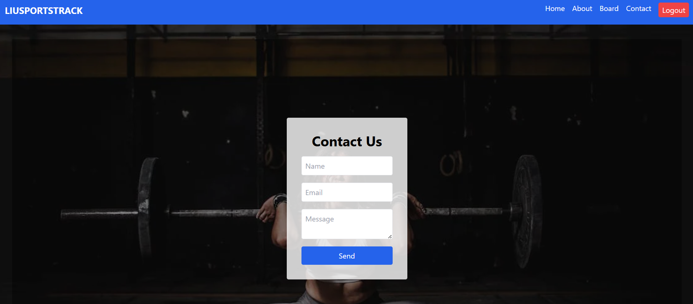

# LIUSPORTSTRACK

**LIUSPORTSTRACK** is a full-stack fitness and wellness tracking web application. It allows users to track exercises, meals, and daily activities, as well as send messages through a contact form. Built with **React**, **Tailwind CSS**, **Node.js**, **Express**, and **MySQL**, it offers a clean, responsive, and interactive user experience.

**Live Demo:** [https://project-1-liusportstrack.vercel.app/](https://project-1-liusportstrack.vercel.app/)

---

## Features

### Authentication
- Sign Up / Login functionality
- Stores users in a MySQL database
- Validates required fields and prevents duplicate emails

### Home Page
- Displays a weekly wellness plan (exercises + meals)
- Card-style layout for each day with responsive design

### About Page
- Explains the purpose of LIUSPORTSTRACK
- Highlights key features and usage

### Activity Board
- Add custom activities with title and details
- Edit and delete activities dynamically
- Real-time updates using React state and Axios requests

### Contact Form
- Submit name, email, and message
- Confirmation alert on successful submission
- Messages stored in the database

### Navigation
- Responsive navbar with links to Home, About, Board, and Contact
- Footer displayed across all pages

---

## Technologies Used

- Frontend: React, React Router, Tailwind CSS, Axios
- Backend: Node.js, Express
- Database: MySQL
- Other: dotenv, cors, nodemon

---

## Project Structure

- backend/
- index.js
- package.json
- .env

- frontend/
- src/
- App.js
- App.css
- index.js
- components/
- Navbar.jsx
- Footer.jsx
- Home.jsx
- About.jsx
- Contact.jsx
- Board.jsx
- Login.jsx
- package.json

## Setup Instructions

### Backend
cd backend

npm install

- host: process.env.DB_HOST,
- user: process.env.DB_USER,
- password: process.env.DB_PASSWORD,
- database: process.env.DB_NAME,
- port: process.env.DB_PORT || 3306

npm start
### FrontEnd
cd frontend

npm install

npm start

## API Endpoints

### Authentication

### POST /signup – Register a new user

### POST /login – Log in a user

### Home Plan

### GET /home-plan – Fetch weekly wellness plan

### Activities

### GET /activities – List all activities

### POST /activities – Add a new activity

### PUT /activities/:id – Update an activity

### DELETE /activities/:id – Delete an activity

## Contact

### POST /contact – Send a message

## Screenshots

### Login Page

### Home Page

### About Page

### Activity Board

### Contact Page

